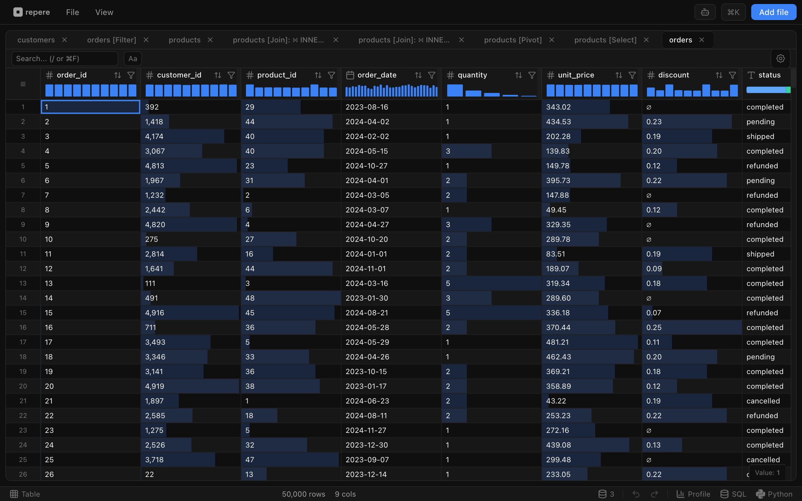
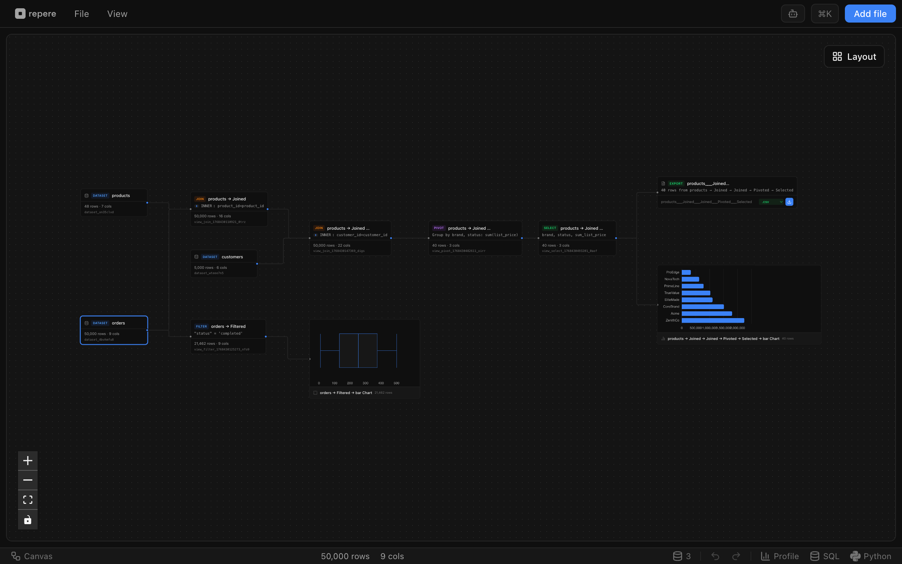

# repere

**Data explorer for datasets too large for spreadsheets.**

Run SQL queries on CSV, Parquet, and Excel files locally. No uploads, no servers-your data never leaves your machine.

[](https://opensource.org/licenses/MIT)




## Why repere?

- **100% Local** - Data stays on your machine. Nothing is uploaded to any server.
- **Handle Large Files** - Process CSV, Parquet, XLSX, and JSON files with millions of rows.
- **SQL Power** - Full SQL support via DuckDB with autocomplete.
- **Visual Pipeline** - See your data transformations as a DAG on an interactive canvas.
- **Shareable** - Export your work as a self-contained HTML file anyone can open.
- **Web or Desktop** - Use in any modern browser, or download the portable desktop app.

## Features

| Category | Operations |
|----------|------------|
| **Query** | Filter, Sort, Limit |
| **Columns** | Select, Add, Remove, Rename, Reorder, Cast type |
| **Edit** | Edit cells, Fill nulls, Replace values |
| **Aggregate** | Group By, Pivot (with subtotals/grand totals), Unpivot |
| **Window** | ROW_NUMBER, RANK, LAG/LEAD, Running aggregates |
| **Combine** | Join (inner/left/right/full/cross), Union, Distinct |
| **Visualize** | 15+ chart types (bar, line, pie, scatter, heatmap, treemap, box plot), Dashboards |
| **Analyze** | Column profiling, Statistics, Histograms, Outlier detection, Correlation matrix |
| **AI** | Natural language data exploration with intelligent agents |
| **Python** | pandas, numpy, matplotlib via Pyodide (web) or native (desktop) |
| **SQL** | Raw SQL queries with syntax highlighting and autocomplete |
| **Export** | CSV, Parquet, XLSX, JSON, JSONL, or shareable HTML |

## Supported Formats

- **CSV** - Comma-separated values with automatic type inference
- **Parquet** - Columnar format, great for large datasets
- **XLSX** - Microsoft Excel workbooks
- **JSON / JSONL** - JSON arrays and newline-delimited JSON

## Quick Start

### Use the App

**Web:** Visit [repere.ai](https://repere.ai)

**Desktop:** Download the portable binary for your platform from [Releases](https://github.com/mattismegevand/repere/releases):
- macOS (Apple Silicon / Intel)
- Windows
- Linux

### Develop

```bash
# Clone the repository
git clone https://github.com/mattismegevand/repere.git
cd repere

# Install dependencies
bun install

# Start development server
bun run dev
```

For desktop app development (Tauri):

```bash
# Install Rust and Tauri CLI first
bun run tauri dev
```

## How It Works

1. **Load datasets** - Drop CSV, Parquet, XLSX, or JSON files to create root nodes
2. **Apply operations** - Filter, sort, group, join, pivot to create derived views
3. **Lazy evaluation** - Each view is a DuckDB VIEW, computed on-demand
4. **Visual canvas** - See and navigate your full transformation pipeline
5. **Share** - Export as self-contained HTML or save as .repere session file

## Keyboard Shortcuts

| Key | Action |
|-----|--------|
| `⌘K` | Command palette |
| `⌘O` | Open file |
| `⌘S` | Save session |
| `⌘Z` / `⌘⇧Z` | Undo / Redo |
| `⌘/` | Toggle canvas/table view |
| `` ⌘` `` | SQL editor |
| `⌘?` | All shortcuts |

## Tech Stack

- [React 19](https://react.dev) + [TypeScript](https://www.typescriptlang.org) + [Vite](https://vite.dev) + [Bun](https://bun.sh)
- [DuckDB-WASM](https://duckdb.org/docs/api/wasm/overview.html) (web) / [Native DuckDB](https://duckdb.org) (desktop via [Tauri](https://tauri.app))
- [TanStack Virtual](https://tanstack.com/virtual) - Virtualized data grid
- [React Flow](https://reactflow.dev) - Interactive pipeline canvas
- [ECharts](https://echarts.apache.org) - Charts and sparklines
- [Zustand](https://zustand-demo.pmnd.rs) - State management
- [Tailwind CSS v4](https://tailwindcss.com)

## Contributing

Contributions are welcome! See [CLAUDE.md](CLAUDE.md) for development guidelines, code style, and architecture notes.

```bash
# Before submitting a PR
bun run test
bun run lint
bun run format
bun run build
```

## Author

[Mattis Megevand](https://mattismegevand.com)

## License

MIT
